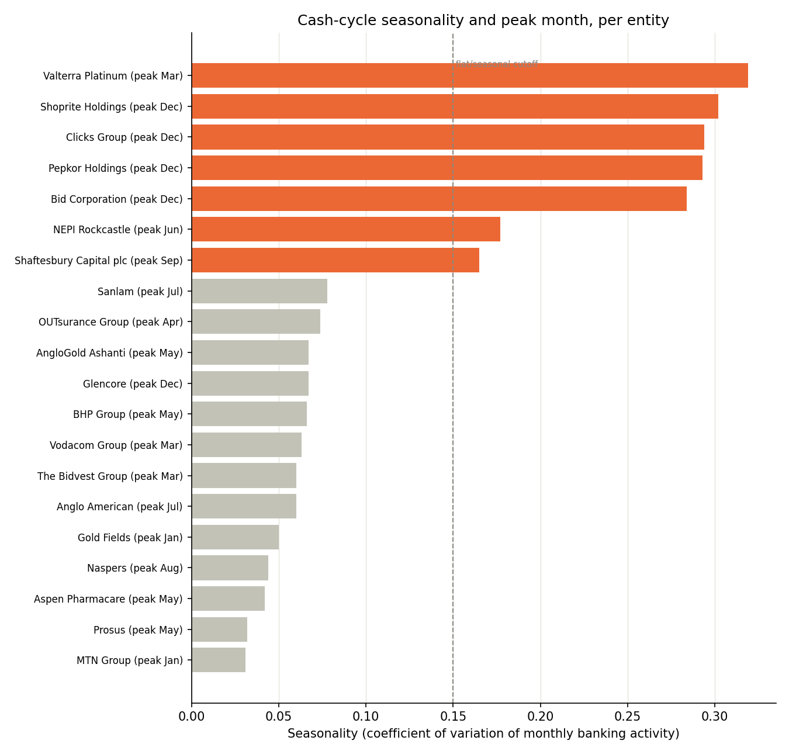

# Cash-Cycle / Payment-Timing (Phase 7 bonus module)

hackathon.txt's Phase 7(a) spec, verbatim: *"per entity, model days between outbound supplier legs and inbound collections to suggest optimal engagement timing."*

## The literal day-grain ask, checked against the data — a disclosed dead signal

Volume-weighted day-of-month for `collections` has a 7.8% coefficient of variation across the month; `supplier_payments`, 8.0%. Both are close to what a uniform (no clustering) distribution would produce, and day-of-week volume is flatter still (<1% CV, checked separately). Every one of the 20 entities' volume-weighted peak day converges to the same ~day 15-16 — there is no real per-entity day-of-month signal to rank on here. Computing a 'days between' gap anyway would be noise straddling a 30-day wraparound, not a finding — this is the same discipline this project applied to the FX currency-pair dead signal (METHODOLOGY.md §6.3) and `breadth_score` clustering (§7.2): disclose the null result rather than manufacture a ranking from it.

## What the data DOES support: month-of-year seasonality

Monthly banking activity (collections + supplier payments combined, summed across the full ~3-year ledger by calendar month) has real, sector-coherent structure. 

| Rank | Entity | Sector | Seasonality (CV) | Peak month | Suggested engagement month |
|---|---|---|---|---|---|
| 1 | Valterra Platinum | mining | 0.319 | Mar | Jan |
| 2 | Shoprite Holdings | consumer | 0.302 | Dec | Oct |
| 3 | Clicks Group | consumer | 0.294 | Dec | Oct |
| 4 | Pepkor Holdings | consumer | 0.293 | Dec | Oct |
| 5 | Bid Corporation | consumer | 0.284 | Dec | Oct |
| 6 | NEPI Rockcastle | real_estate | 0.177 | Jun | Apr |
| 7 | Shaftesbury Capital plc | real_estate | 0.165 | Sep | Jul |
| 8 | Sanlam | insurance | 0.078 | Jul | n/a — flat activity, engage anytime |
| 9 | OUTsurance Group | insurance | 0.074 | Apr | n/a — flat activity, engage anytime |
| 10 | Glencore | mining | 0.067 | Dec | n/a — flat activity, engage anytime |
| 11 | AngloGold Ashanti | mining | 0.067 | May | n/a — flat activity, engage anytime |
| 12 | BHP Group | mining | 0.066 | May | n/a — flat activity, engage anytime |
| 13 | Vodacom Group | telecoms | 0.063 | Mar | n/a — flat activity, engage anytime |
| 14 | Anglo American | mining | 0.060 | Jul | n/a — flat activity, engage anytime |
| 15 | The Bidvest Group | industrials_pharma | 0.060 | Mar | n/a — flat activity, engage anytime |
| 16 | Gold Fields | mining | 0.050 | Jan | n/a — flat activity, engage anytime |
| 17 | Naspers | tech | 0.044 | Aug | n/a — flat activity, engage anytime |
| 18 | Aspen Pharmacare | industrials_pharma | 0.042 | May | n/a — flat activity, engage anytime |
| 19 | Prosus | tech | 0.032 | May | n/a — flat activity, engage anytime |
| 20 | MTN Group | telecoms | 0.031 | Jan | n/a — flat activity, engage anytime |

## Reading the ranking

**7 of 20 entities clear the 15% seasonality threshold** and share an obvious sector pattern: all 4 consumer/retail entities in the portfolio (Shoprite, Bid Corporation, Pepkor, Clicks) are in the top 5, every one peaking in December — the expected pre-Christmas retail volume surge. Valterra Platinum (mining, March peak) is the one exception to the retail-only pattern, reported as-is rather than smoothed over.

**The remaining 13 entities are close to flat year-round** (CV well under 15%, mostly mining, insurance, tech and telecoms) — for these, month-of-year is not a meaningful engagement lever; timing outreach around this signal would be manufacturing a hook that isn't really there for them.

`suggested_engagement_month` = peak month − 2 months, for seasonal entities only — while the client's treasury team still has bandwidth for a strategic conversation, ahead of their own operational peak (see `ENGAGEMENT_LEAD_MONTHS` in `src/cash_cycle.py`).

## Methodology note

No revenue or NII figure is estimated by this module — deliberately descriptive/behavioural only, per this project's assumption-naming discipline (config/assumptions.yaml, CLAUDE.md). `seasonality_cv` is the coefficient of variation (std/mean) of an entity's monthly combined `collections` + `supplier_payments` volume across the 12 calendar months, summed over the full ledger date range — not calendar-year-over-year, a single 12-bucket seasonal profile.