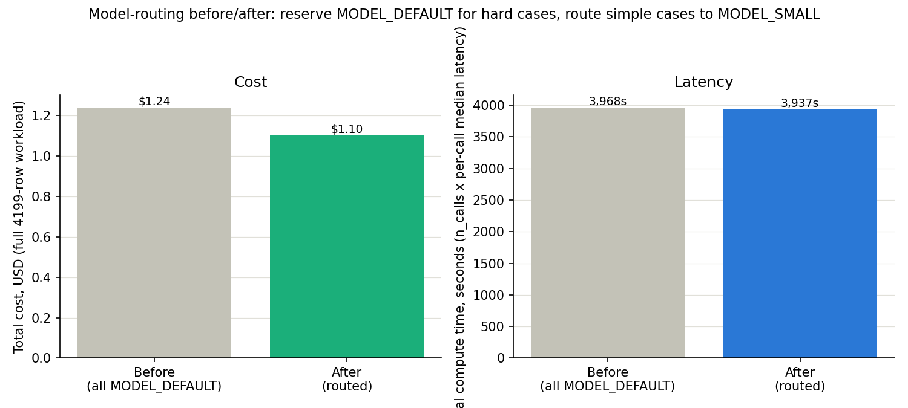

# Latency & Cost Optimisation (Phase 7 bonus module)

hackathon.txt's Phase 7(b) spec, verbatim: *"instrument the LLM pipeline, add caching, batching, and route simple classification to a small model reserving the large one for hard cases. Produce a before/after latency and cost chart."*

Caching and prompt logging (`src.llm.generate_structured`) have been in every LLM call since Phase 2 (see CLAUDE.md). This module adds the piece that wasn't built yet: routing, using gemini-2.5-flash for everything as the 'before' (Phase 2's actual historical run) vs. routing 'simple' rows to gemini-3.1-flash-lite as the 'after'.

## Routing rule

Reuses `src/forensics.py`'s existing `regex_confidence` signal — 0.85 where an explicit syndicate/bridging/bilateral keyword is present in the memo (`simple`), 0.40 otherwise (`hard`). Not a new judgement call invented for this module: **2,117 of 4,199 rows (50%) are `simple`** and route to gemini-3.1-flash-lite; the remaining 2,082 (`hard`) stay on gemini-2.5-flash, exactly as Phase 2 already ran them.

## Safety check: does the cheap model agree with the original answer?

90 freshly-sampled `simple` rows were re-run on gemini-3.1-flash-lite and compared against Phase 2's ORIGINAL gemini-2.5-flash answer for the exact same row (already on file in `competitor_credit_events.parquet`) — a measured agreement rate, not an assumption:

**`facility_type` agreement: 100.0%** (90 rows compared).

This is high enough to trust the routing — the `simple` bucket earns its name; an explicit keyword match leaves little for a smaller model to get wrong.

## Before / after, extrapolated to the full portfolio

| | Before (all MODEL_DEFAULT) | After (routed) | Change |
|---|---|---|---|
| Total cost (USD, 4,199 rows) | $1.24 | $1.10 | **-11%** ($0.14 saved) |
| Total compute time (s) | 3,968s | 3,937s | **-1%** |
| Cost per call | $0.000296 (gemini-2.5-flash) | $0.000230 (gemini-3.1-flash-lite) on the routed share | — |
| Median per-call latency | 945ms | 931ms (gemini-3.1-flash-lite, routed share) | — |

## Reading the latency result

Routing saved 1% of total compute time as well as cost.

## Methodology notes

- **'Before' is Phase 2's real historical run**, not a resimulation: median/mean latency and token counts come from reports/llm_usage_log.jsonl's `forensics_memo_extraction` namespace, `cached=False` rows only (a cache hit is 0ms/free and would understate the baseline this module is trying to improve on).
- **'Total compute time' is n_calls x per-call median latency, not observed wall-clock time** — Phase 2 ran with `--max-workers 12` concurrent calls, so actual wall-clock was far shorter than this sum for both 'before' and 'after'. This metric is a fair apples-to-apples workload-size comparison between the two routing strategies at the same concurrency, not a wall-clock claim.
- **Pricing**: gemini-2.5-flash $0.3/1M input, $2.5/1M output tokens; gemini-3.1-flash-lite $0.25/1M input, $1.5/1M output tokens (paid tier). Source: https://ai.google.dev/gemini-api/docs/pricing, retrieved 2026-08-11.
- The historical median latency (not mean) is used deliberately: Phase 2's own usage log has a small number of extreme-tail retries (see CLAUDE.md 'Must-know' #6 — the `httpx.ReadError`/transient-failure retry fix), which would badly distort a mean-based 'before' figure.