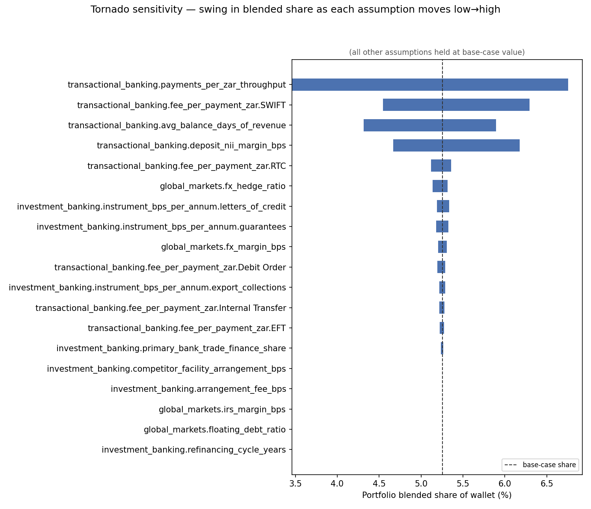

# Phase 5 — Rigor Layer Report

Five analyses per hackathon.txt's Phase 5 spec, all built on `config/assumptions.yaml`'s `low`/`high` ranges (never a second, disconnected set of "uncertainty parameters").

## 1. Monte Carlo — portfolio blended share of wallet as a credible interval

**2,000 iterations.** Base-case point estimate: 5.3%. 5th–95th percentile credible interval: **3.1% – 6.8%** (median 4.6%, mean 4.7%, std 1.1%). Never report the base-case point estimate alone -- this range is the honest answer.

**By pillar:**

| pillar                | p5    | p50   | p95   |
|:----------------------|:------|:------|:------|
| Global Markets        | 2.9%  | 3.5%  | 4.4%  |
| Investment Banking    | 36.1% | 44.9% | 53.9% |
| Transactional Banking | 2.8%  | 4.3%  | 6.6%  |

## 2. Tornado sensitivity — which assumption moves the answer most

Each row varies ONE assumption across its full low→high range (`config/assumptions.yaml`) with every other assumption held at its base-case value, and measures the resulting swing in portfolio blended share of wallet. Sorted by impact, largest first.

**5 assumptions show exactly 0.00pp *share* swing** (global_markets.floating_debt_ratio, investment_banking.refinancing_cycle_years, investment_banking.arrangement_fee_bps, global_markets.irs_margin_bps, investment_banking.competitor_facility_arrangement_bps) -- not an error, and NOT the same as having no impact (their `tam_swing_R_m` column below is very much non-zero). `blended_tam_and_captured` (METHODOLOGY.md §5.3) only sums sub-components where BOTH tam and captured are observable on the same row; these assumptions exclusively drive TAM on the 3 sub-components with a structurally-unobservable captured side (`rate_hedging`, `debt_arrangement`, `competitor_credit_gap`), which are excluded from the blended-share RATIO by definition -- moving them changes total addressable wallet (hence the real `tam_swing_R_m` figures, computed independently of the share metric) without changing the *fraction of it Syn Bank is measured as capturing*, because there's no captured figure to divide by for those rows. Do not read the 0.00pp column as "these assumptions don't matter."

| assumption                                                     |    low_value |    base_value |   high_value | share_at_low   | share_at_high   | share_swing_pp   |   tam_swing_R_m |
|:---------------------------------------------------------------|-------------:|--------------:|-------------:|:---------------|:----------------|:-----------------|----------------:|
| transactional_banking.payments_per_zar_throughput              |   8.3333e-06 |   1.33333e-05 |      2.5e-05 | 6.8%           | 3.5%            | 3.30pp           |         13797.4 |
| transactional_banking.fee_per_payment_zar.SWIFT                | 150          | 250           |    350       | 6.3%           | 4.5%            | 1.75pp           |          7053   |
| transactional_banking.avg_balance_days_of_revenue              |  10          |  15           |     25       | 5.9%           | 4.3%            | 1.58pp           |          6065.9 |
| transactional_banking.deposit_nii_margin_bps                   | 150          | 200           |    300       | 4.7%           | 6.2%            | 1.51pp           |          4549.4 |
| transactional_banking.fee_per_payment_zar.RTC                  |  20          |  35           |     55       | 5.4%           | 5.1%            | 0.24pp           |          1234.3 |
| global_markets.fx_hedge_ratio                                  |   0.5        |   0.6         |      0.8     | 5.3%           | 5.1%            | 0.18pp           |           641.7 |
| investment_banking.instrument_bps_per_annum.letters_of_credit  |  50          |  80           |    120       | 5.2%           | 5.3%            | 0.15pp           |            68.3 |
| investment_banking.instrument_bps_per_annum.guarantees         | 100          | 150           |    200       | 5.2%           | 5.3%            | 0.15pp           |            68.2 |
| global_markets.fx_margin_bps                                   |  10          |  20           |     30       | 5.3%           | 5.2%            | 0.10pp           |          1283.3 |
| transactional_banking.fee_per_payment_zar.Debit Order          |   4          |   8           |     15       | 5.3%           | 5.2%            | 0.09pp           |           387.9 |
| investment_banking.instrument_bps_per_annum.export_collections |  20          |  40           |     60       | 5.2%           | 5.3%            | 0.07pp           |            34.1 |
| transactional_banking.fee_per_payment_zar.Internal Transfer    |   2          |   5           |     10       | 5.3%           | 5.2%            | 0.06pp           |           282.1 |
| transactional_banking.fee_per_payment_zar.EFT                  |   8          |  15           |     25       | 5.3%           | 5.2%            | 0.05pp           |           599.5 |
| investment_banking.primary_bank_trade_finance_share            |   0.35       |   0.45        |      0.55    | 5.2%           | 5.3%            | 0.03pp           |           100.3 |
| global_markets.floating_debt_ratio                             |   0.3        |   0.4         |      0.5     | 5.3%           | 5.3%            | 0.00pp           |           506   |
| investment_banking.refinancing_cycle_years                     |   3          |   4           |      5       | 5.3%           | 5.3%            | 0.00pp           |          3373.2 |
| investment_banking.arrangement_fee_bps                         |  50          | 100           |    150       | 5.3%           | 5.3%            | 0.00pp           |          6324.7 |
| global_markets.irs_margin_bps                                  |   5          |  10           |     15       | 5.3%           | 5.3%            | 0.00pp           |          1011.9 |
| investment_banking.competitor_facility_arrangement_bps         |  50          | 100           |    150       | 5.3%           | 5.3%            | 0.00pp           |             0   |

## 3. Second, independent SOW estimator — revealed presence vs. yield-based estimate

Not derived from any yield assumption at all: a 0-1 breadth score from how many of Syn Bank's product channels, trade-finance instrument types, and country corridors each entity actually uses, mapped onto a SOW-comparable percentage via a calibration disclosed in `config/assumptions.yaml`'s `revealed_presence` section (a rough calibration, not a precision instrument -- see METHODOLOGY.md Phase 5). **Where the two estimators diverge is the most interesting finding here, surfaced explicitly, not averaged away.**

**19/20 entities show presence-based > yield-based** — a systematic pattern, not scattered noise, and worth reading carefully rather than at face value. All 20 entities in this portfolio are large, actively-engaged corporates already using most of Syn Bank's product range (breadth scores cluster tightly, 0.77-0.91) — this specific client set gives the revealed-presence estimator little room to discriminate low-engagement from high-engagement clients, so it defaults most entities toward the upper half of its calibrated range. Read the SIZE of each divergence with that in mind: a consistently-high presence-based estimate across nearly the whole portfolio is more a statement about this method's limited discriminating power on an already-broad client base than a claim that yield-based estimates are all wrong by ~30pp.

**The one entity where it runs the other way is the most useful cross-check here: Pepkor Holdings (E11)**, at -21.5pp — its yield-based share (62.7%) *exceeds* even the top-of-range presence-based estimate (41.2%). This is the same entity flagged with a TAM-assumption breach in Phase 4 (METHODOLOGY.md §5.2) — an estimator that knows nothing about that breach independently lands well below the yield-based figure, corroborating that the yield-based 62.7% is inflated by the too-conservative deposit_nii TAM assumption, not a genuine outlier level of capture.

| entity_id   | entity_name             | sector             |   revealed_presence_score | presence_based_share_pct   | yield_based_share_pct   | divergence_pp   |
|:------------|:------------------------|:-------------------|--------------------------:|:---------------------------|:------------------------|:----------------|
| E12         | Clicks Group            | consumer           |                      0.88 | 40.3pp                     | 0.7pp                   | 39.6pp          |
| E06         | Valterra Platinum       | mining             |                      0.86 | 39.4pp                     | 0.6pp                   | 38.8pp          |
| E02         | Glencore                | mining             |                      0.86 | 39.4pp                     | 0.7pp                   | 38.8pp          |
| E15         | Naspers                 | tech               |                      0.82 | 37.9pp                     | 1.2pp                   | 36.7pp          |
| E07         | OUTsurance Group        | insurance          |                      0.82 | 37.9pp                     | 1.8pp                   | 36.1pp          |
| E17         | Vodacom Group           | telecoms           |                      0.9  | 40.9pp                     | 4.8pp                   | 36.1pp          |
| E14         | Prosus                  | tech               |                      0.82 | 37.9pp                     | 2.4pp                   | 35.6pp          |
| E13         | NEPI Rockcastle         | real_estate        |                      0.82 | 37.9pp                     | 3.2pp                   | 34.8pp          |
| E09         | Shoprite Holdings       | consumer           |                      0.9  | 41.2pp                     | 7.4pp                   | 33.8pp          |
| E04         | AngloGold Ashanti       | mining             |                      0.88 | 40.3pp                     | 8.2pp                   | 32.1pp          |
| E05         | Gold Fields             | mining             |                      0.85 | 39.1pp                     | 7.1pp                   | 32.0pp          |
| E18         | The Bidvest Group       | industrials_pharma |                      0.91 | 41.5pp                     | 9.9pp                   | 31.6pp          |
| E20         | Shaftesbury Capital plc | real_estate        |                      0.77 | 35.9pp                     | 4.8pp                   | 31.1pp          |
| E10         | Bid Corporation         | consumer           |                      0.86 | 39.4pp                     | 8.3pp                   | 31.1pp          |
| E16         | MTN Group               | telecoms           |                      0.89 | 40.6pp                     | 10.6pp                  | 30.0pp          |
| E01         | BHP Group               | mining             |                      0.82 | 37.9pp                     | 8.5pp                   | 29.5pp          |
| E19         | Aspen Pharmacare        | industrials_pharma |                      0.88 | 40.0pp                     | 15.4pp                  | 24.6pp          |
| E11         | Pepkor Holdings         | consumer           |                      0.9  | 41.2pp                     | 62.7pp                  | -21.5pp         |
| E03         | Anglo American          | mining             |                      0.87 | 39.7pp                     | 18.8pp                  | 20.9pp          |
| E08         | Sanlam                  | insurance          |                      0.9  | 40.9pp                     | 25.3pp                  | 15.6pp          |

## 4. Sector regression of wallet-intensity (TAM / revenue)

Portfolio-wide log-log regression (log TAM ~ log revenue, n=20): R² = 0.82, p = 0.000. 

Entities flagged **below their sector line** (wallet-intensity z-score < -1.0 within a sector of ≥3 peers): **2**. Sectors with <3 peers are noted, not scored (too few points for a meaningful within-sector comparison).

| entity_id   | entity_name             | sector             |   sector_n |   wallet_intensity |   z_score_in_sector | below_sector_line   |
|:------------|:------------------------|:-------------------|-----------:|-------------------:|--------------------:|:--------------------|
| E01         | BHP Group               | mining             |          6 |              0.005 |                1.03 | False               |
| E02         | Glencore                | mining             |          6 |              0.003 |               -0.67 | False               |
| E03         | Anglo American          | mining             |          6 |              0.005 |                1.12 | False               |
| E04         | AngloGold Ashanti       | mining             |          6 |              0.003 |               -0.82 | False               |
| E05         | Gold Fields             | mining             |          6 |              0.004 |                0.48 | False               |
| E06         | Valterra Platinum       | mining             |          6 |              0.002 |               -1.15 | True                |
| E07         | OUTsurance Group        | insurance          |          2 |              0.002 |               -0.71 | False               |
| E08         | Sanlam                  | insurance          |          2 |              0.002 |                0.71 | False               |
| E09         | Shoprite Holdings       | consumer           |          4 |              0.003 |                0.5  | False               |
| E10         | Bid Corporation         | consumer           |          4 |              0.003 |               -0.54 | False               |
| E11         | Pepkor Holdings         | consumer           |          4 |              0.003 |                1.13 | False               |
| E12         | Clicks Group            | consumer           |          4 |              0.003 |               -1.09 | True                |
| E13         | NEPI Rockcastle         | real_estate        |          2 |              0.013 |               -0.71 | False               |
| E14         | Prosus                  | tech               |          2 |              0.007 |                0.71 | False               |
| E15         | Naspers                 | tech               |          2 |              0.007 |               -0.71 | False               |
| E16         | MTN Group               | telecoms           |          2 |              0.004 |               -0.71 | False               |
| E17         | Vodacom Group           | telecoms           |          2 |              0.004 |                0.71 | False               |
| E18         | The Bidvest Group       | industrials_pharma |          2 |              0.004 |               -0.71 | False               |
| E19         | Aspen Pharmacare        | industrials_pharma |          2 |              0.005 |                0.71 | False               |
| E20         | Shaftesbury Capital plc | real_estate        |          2 |              0.018 |                0.71 | False               |

## 5. Time-trend test — per-entity and per-corridor

Quarterly volume (all 3 files combined), linear trend test per entity (20 tests) and per currency-pair corridor (5 tests). At raw p<0.05: **9/20 entities** and **0/5 corridors** show a statistically significant trend. Testing this many series at once risks false positives by chance alone (~1.0 expected among the entity tests even with NO real trend anywhere) -- at a Bonferroni-adjusted threshold, **5/20 entities** and **0/5 corridors** remain significant. 

**Corridors are flat (0/5 significant even at raw p<0.05) — consistent with Phase 1's aggregate finding. But 5 individual entities show a trend robust enough to survive Bonferroni correction, which the portfolio-flat aggregate finding does NOT rule out and should not be read as ruling out: BHP Group (growing, R²=0.75); Anglo American (shrinking, R²=0.92); OUTsurance Group (growing, R²=0.94); Sanlam (shrinking, R²=0.99); NEPI Rockcastle (growing, R²=0.84).** These are genuine per-client signals worth a coverage banker's attention (a growing or shrinking relationship, ahead of it showing up in any aggregate number) — the correct reading of this section is "the portfolio in aggregate is flat, AND a handful of specific clients are moving," not one or the other.

**Per-entity:**

| entity_id   | entity_name             |   n_quarters |   r_squared |   p_value | significant_p05   | significant_bonferroni   |
|:------------|:------------------------|-------------:|------------:|----------:|:------------------|:-------------------------|
| E01         | BHP Group               |           12 |        0.75 |     0     | True              | True                     |
| E02         | Glencore                |           12 |        0.1  |     0.321 | False             | False                    |
| E03         | Anglo American          |           12 |        0.92 |     0     | True              | True                     |
| E04         | AngloGold Ashanti       |           12 |        0.49 |     0.011 | True              | False                    |
| E05         | Gold Fields             |           12 |        0.25 |     0.096 | False             | False                    |
| E06         | Valterra Platinum       |           12 |        0.32 |     0.057 | False             | False                    |
| E07         | OUTsurance Group        |           12 |        0.94 |     0     | True              | True                     |
| E08         | Sanlam                  |           12 |        0.99 |     0     | True              | True                     |
| E09         | Shoprite Holdings       |           12 |        0    |     0.965 | False             | False                    |
| E10         | Bid Corporation         |           12 |        0.43 |     0.021 | True              | False                    |
| E11         | Pepkor Holdings         |           12 |        0.01 |     0.741 | False             | False                    |
| E12         | Clicks Group            |           12 |        0.03 |     0.608 | False             | False                    |
| E13         | NEPI Rockcastle         |           12 |        0.84 |     0     | True              | True                     |
| E14         | Prosus                  |           12 |        0.02 |     0.697 | False             | False                    |
| E15         | Naspers                 |           12 |        0.07 |     0.413 | False             | False                    |
| E16         | MTN Group               |           12 |        0.08 |     0.383 | False             | False                    |
| E17         | Vodacom Group           |           12 |        0    |     0.993 | False             | False                    |
| E18         | The Bidvest Group       |           12 |        0.52 |     0.008 | True              | False                    |
| E19         | Aspen Pharmacare        |           12 |        0.41 |     0.026 | True              | False                    |
| E20         | Shaftesbury Capital plc |           12 |        0.01 |     0.726 | False             | False                    |

**Per-corridor:**

| currency_pair   |   n_quarters |   r_squared |   p_value | significant_p05   | significant_bonferroni   |
|:----------------|-------------:|------------:|----------:|:------------------|:-------------------------|
| AED/ZAR         |           12 |        0.01 |     0.739 | False             | False                    |
| CNY/ZAR         |           12 |        0.11 |     0.296 | False             | False                    |
| EUR/ZAR         |           12 |        0.07 |     0.394 | False             | False                    |
| GBP/ZAR         |           12 |        0.1  |     0.304 | False             | False                    |
| USD/ZAR         |           12 |        0.19 |     0.154 | False             | False                    |